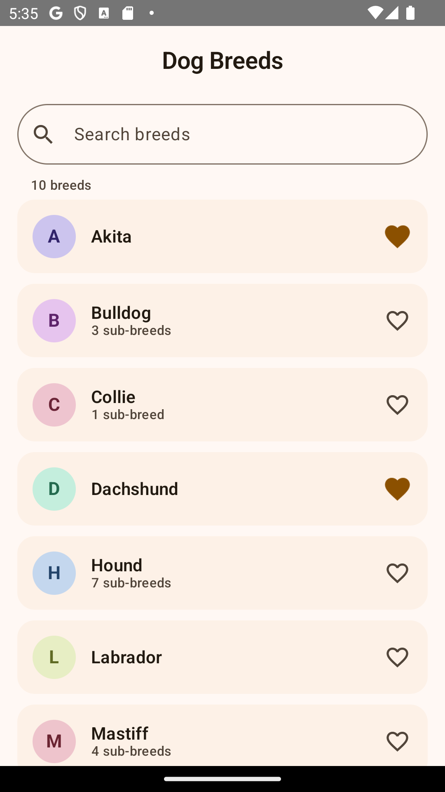
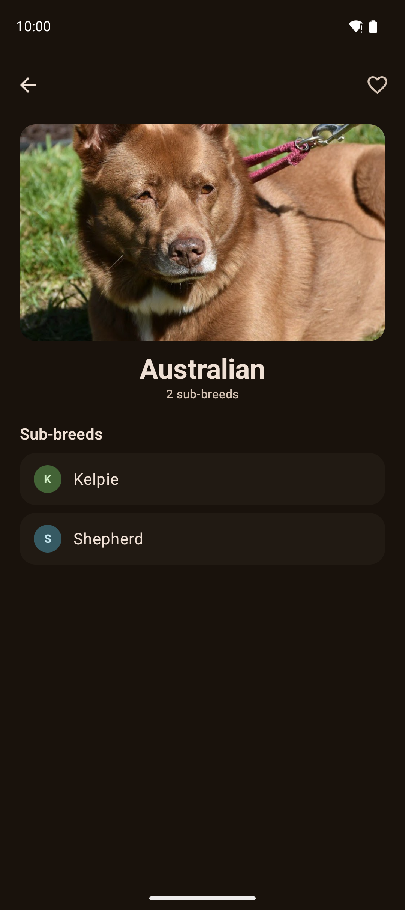

# Mini-Breeds

A small master–detail Android app, 100% Jetpack Compose, that lists dog breeds from
[dog.ceo](https://dog.ceo/dog-api/) (`GET https://dog.ceo/api/breeds/list/all`), shows
each breed's sub-breeds on a detail screen, and handles loading and failure states
explicitly.

**Bonus features implemented:** real-time search filtering of the breed list, and
favorites persisted across app restarts with Preferences DataStore.

**UI:** custom warm Material 3 theme (light + dark), card-based list with per-breed
color-coded monogram avatars (hue derived from the breed name, stable everywhere the
breed appears), pill-shaped search bar, spring-animated favorite hearts, animated
list reordering while filtering, and illustrated empty/error states.

| Breed list | Breed detail |
|---|---|
|  |  |

**New to the codebase?** [WALKTHROUGH.md](WALKTHROUGH.md) explains every class
and function in plain language. [ALTERNATIVES.md](ALTERNATIVES.md) goes deeper
on each decision: the alternative implementations considered, their honest
trade-offs, and the deciding factor.

## Tech stack

| Concern | Choice |
|---|---|
| UI | Jetpack Compose + Material 3, single-activity, custom warm light/dark theme |
| Architecture | MVVM, unidirectional data flow, `StateFlow` UI state |
| Navigation | Navigation Compose with typed (`@Serializable`) routes |
| Networking | Retrofit 3 + OkHttp 5 + kotlinx.serialization |
| DI | Koin 4 |
| Persistence | Preferences DataStore (favorites) |
| Tests | JUnit4, Turbine, MockWebServer 3, Compose UI test, hand-written fakes |

## Module / package structure

A single `:app` module with strictly layered packages — modularity comes from package
boundaries and interfaces, not Gradle modules (at this size, extra modules would add
build complexity without buying any decoupling that interfaces don't already provide):

```
core\             AppError, AppResult, DispatcherProvider — no Android/library deps
data\remote\      DTO, Retrofit service, safeApiCall
data\local\       FavoritesDataSource (interface) + DataStore implementation
data\repository\  BreedRepositoryImpl (in-memory StateFlow cache)
domain\           Breed model, BreedRepository interface
ui\breedlist\     UiState, ViewModel, screen (stateless + stateful route wrapper)
ui\breeddetail\   UiState, ViewModel, screen
ui\navigation\    Typed routes, NavHost
ui\common\        AppError→string mapping, Loading/Error composables
di\               Koin modules (network / data / viewModel)
```

The layering rule: `ui` depends only on `domain` + `core`; `data` is the only package
that imports Retrofit or DataStore. The `BreedRepository` interface is the seam between
the two halves.

## Error handling

All failures crossing a layer boundary are values of a sealed `AppError` taxonomy
(`NoConnection`, `Timeout`, `Http(code)`, `Serialization`, `ApiStatus(status)`,
`Unknown`), wrapped in `AppResult<T>` — never raw exceptions.

- **`safeApiCall` is the single choke point** where transport exceptions are caught and
  mapped (`data\remote\SafeApiCall.kt`). `CancellationException` is rethrown so
  structured concurrency keeps working. Nothing above the data layer ever catches
  network/parsing exceptions.
- The API's own `"status"` field is checked even on HTTP 2xx — a `"status": "error"`
  body becomes `AppError.ApiStatus`, not silently-empty content.
- The repository logs every `Failure` at one place (`Log.w`), so swapping in
  Crashlytics later is a one-line change.
- `ui\common\UiError.kt` maps each `AppError` case to a distinct, user-friendly string
  resource; every error screen offers Retry.
- A corrupted DataStore file degrades to an empty favorites set instead of crashing.

## Design decisions & rationale

**No use-case layer.** The domain has two read paths and one toggle; use cases would be
pure pass-throughs. The `BreedRepository` interface already gives ViewModels a fake-able
boundary. Adding the layer would be ceremony, not architecture — it can be introduced
later if business logic appears.

**Koin over Hilt.** No annotation processing (faster builds, no KSP coupling to the
Kotlin version — this project runs Kotlin 2.4 under AGP 9's built-in Kotlin where
processor compatibility is the riskiest dependency), simple explicit module
declarations, and first-class Compose/ViewModel support. The DI graph is verified by a
unit test (`KoinModulesTest` using Koin's `verify()`), recovering most of the
compile-time safety Hilt would give.

**DataStore over Room.** Favorites are a single `Set<String>`. Room would mean an
entity, a DAO and a database for what is semantically one preference value. Preferences
DataStore gives coroutine-native, transactional persistence with a `Flow` API in a few
lines.

**Hand-written fakes over mocking libraries.** Every boundary is an interface, so fakes
are ~40 trivial lines, readable, and immune to mocking-agent/Kotlin-version
incompatibilities. The HTTP layer is tested against the *real* Retrofit/OkHttp/Json
stack with MockWebServer rather than mocked, so converter and error-mapping behavior is
actually exercised.

**Navigation passes only the breed name.** The detail screen derives sub-breeds and
favorite state from the repository cache. If the cache is gone (process death), the
detail ViewModel refetches itself — routes stay trivially serializable and there is no
risk of stale parceled data.

**Detail ViewModel reads the route argument via `SavedStateHandle[key]`** instead of
`SavedStateHandle.toRoute()`: typed navigation stores route arguments under their
property names, and the key-based read keeps the ViewModel unit-testable on the JVM,
where `toRoute()` requires a real Android `Bundle`.

**Stateless screens + stateful route wrappers.** Each screen is a pure function of
`(UiState, callbacks)`, previewable and UI-testable without Koin or network; thin
`*Route` wrappers own the `koinViewModel()` + `collectAsStateWithLifecycle()` wiring.

**Search lives in the ViewModel, outside the load state.** The query `StateFlow` is kept
separate from the Loading/Error/Content state so typed text survives a retry; filtering
is a pure function combined with the favorites flow, which makes it directly unit
testable. No debounce — the filter is local and instant.

## Tests

See [TESTING.md](TESTING.md) for how to run each suite, single-test invocation,
report locations, and the manual verification checklist.

Unit tests — 55 across 9 classes (`app\src\test`, run with
`.\gradlew.bat :app:testDebugUnitTest`):

- `AppResultTest` — `map`/`onSuccess`/`onFailure` fire on the right variant
- `BreedsResponseDtoTest` — JSON parsing, unknown-key tolerance, malformed input
- `SafeApiCallTest` — each exception type maps to the expected `AppError`; cancellation rethrown
- `BreedRepositoryImplTest` — real Retrofit/OkHttp against MockWebServer: success mapping/sorting/caching, HTTP 500, garbage body, `"status":"error"`, connection refused, timeout
- `DataStoreFavoritesDataSourceTest` — real JVM DataStore: toggle on/off, persistence, defaults, corrupt-store degradation
- `BreedListViewModelTest` / `BreedDetailViewModelTest` — Turbine flow tests: state transitions, retry, filtering, favorites reactivity, cold-cache refresh
- `KoinModulesTest` — DI graph verified with Koin `verify()`
- `UiErrorTest` — every `AppError` maps to a distinct string resource

Instrumented tests — 18 across 3 classes (`app\src\androidTest`, run with
`.\gradlew.bat :app:connectedDebugAndroidTest`, emulator/device required):

- `BreedListScreenTest` / `BreedDetailScreenTest` — Compose UI tests on the stateless screens (states, callbacks, search, favorites), no Koin or network involved
- `NavigationTest` — real NavHost + real ViewModels with a fake repository injected by overriding the Koin `BreedRepository` definition: list → detail → back, favorite toggle propagation

## Building & running

```
.\gradlew.bat :app:assembleDebug          # build
.\gradlew.bat :app:testDebugUnitTest      # unit tests
.\gradlew.bat :app:connectedDebugAndroidTest  # UI tests (emulator required)
.\gradlew.bat :app:lintDebug :app:assembleRelease
```

Requires JDK 17+; Gradle 9.4 / AGP 9.2 / Kotlin 2.4 (AGP built-in), compileSdk 36,
minSdk 26.

### Installing the release build on a device

Scroll/animation smoothness must be judged on the **release** build — debug
builds of Compose apps run without AOT compilation or R8 and feel several
times slower (measured on a physical device: ~77 ms median frame time in
debug vs ~7 ms in release for the same scroll). The release build type is
R8-optimized and debug-signed precisely so it can be installed locally:

```
.\gradlew.bat :app:installRelease
adb install -r app\build\outputs\apk\release\app-release.apk   # alternative
```

Notes:

- With several devices attached, `installRelease` installs on **all** of them;
  set `$env:ANDROID_SERIAL = "<serial>"` first (see `adb devices`) to target one.
- Installing is silent — it does not launch the app. Open it from the launcher
  or run `adb shell am start -n com.profico.minibreeds/.MainActivity`.
- Pressing Run in Android Studio replaces it with the debug build again;
  reinstall release before judging performance.
- On MIUI/HyperOS devices, enable Developer options → "Install via USB" if the
  install fails with `INSTALL_FAILED_USER_RESTRICTED`.

## Scoped out (deliberately)

- **Multi-module Gradle setup** — package-level layering carries the same boundaries at this size (see above).
- **Pull-to-refresh / pagination** — the endpoint returns one small static payload.
- **Room / offline cache of breeds** — the in-memory `StateFlow` cache plus refetch-on-cold-start covers the navigation and process-death cases the app actually has.
- **Use-case layer** — see rationale above.
